<h1 align="center">ConduTest — Sistema de Exámenes de Tránsito</h1>

  Plataforma para la gestión digital de exámenes teóricos de licencias de conducir. 
  Desarrollada para municipios que buscan transparencia, trazabilidad y eficiencia.

  
  
  
  
  
  

---

ConduTest es una aplicación desarrollada para digitalizar el proceso de evaluación teórica de licencias de conducir en municipios.  
El objetivo fue reemplazar los exámenes en papel por una plataforma confiable, segura y adaptable a distintos entornos municipales.

---

## Idea y Motivación

La idea nació a partir de mi experiencia trabajando en el área de tránsito y observando la falta de herramientas digitales que unifiquen la evaluación, el registro y el control de los exámenes teóricos.  
Quise crear una solución moderna, completa y segura que pudiera utilizarse tanto en PC como en tablets, garantizando transparencia en el proceso y unificando criterios en municipios que disponen de varios centros de examen distantes entre sí.

---

## Tecnologías Utilizadas

- **Frontend:** Flutter (compatible con Android y Windows)  
- **Backend:** ASP.NET Core 8 (C#)  
- **Base de Datos:** PostgreSQL  
- **Infraestructura:** Docker + Caddy + VPS Linux  
- **PDF firmado:** microservicio Python con Endesive  
- **Autenticación:** JWT + validación híbrida de dispositivos  
- **Auditoría:** registro completo de acciones y resultados  

---

## Proceso de Desarrollo

Comencé definiendo la estructura base de los exámenes en archivos JSON, desde donde se cargan las preguntas, opciones e imágenes de señales.  
Luego implementé un backend REST en .NET 8, diseñado para soportar múltiples localidades, con roles diferenciados (superadministrador, administrador general y administradores locales) y validación de licencias.

El frontend en Flutter se conecta mediante JWT, mostrando las preguntas de forma dinámica y permitiendo rendir exámenes cronometrados con resultados automáticos.

La firma digital de cada examen la desarrollé como un microservicio independiente creado en Python mediante API Flask.

Finalmente, desarrollé un panel de administración donde los responsables pueden:

- Cargar o desactivar exámenes  
- Modificar preguntas y respuestas  
- Consultar resultados y estadísticas  
- Configurar el nombre, logo y colores del municipio  
- Crear y gestionar usuarios  
- Autorizar o negar dispositivos conectados  
- Gestionar auditorías y respaldos  

---

## Seguridad y Control

Uno de los puntos clave fue la seguridad del sistema.  
Implementé un modelo híbrido de validación de dispositivos:

- **Autorización local de dispositivos:** aprobada manualmente por el superadmin  
- **Validación remota:** consulta periódica a un archivo hospedado en un repositorio externo que indica si la aplicación sigue habilitada  
- **Cifrado:** campos críticos en base de datos y backups cifrados  

De esta forma, la aplicación puede inutilizarse si el uso es no autorizado, incluso sin conexión constante.  
Además, todos los eventos relevantes quedan registrados en un sistema de auditoría (logins, evaluaciones, configuraciones, modificaciones, etc.).

---

## Retos Técnicos y Decisiones Clave

- Integrar seguridad sin afectar la usabilidad: logré un equilibrio entre control y fluidez  
- Generación de PDFs firmados digitalmente mediante microservicio Python con certificados PFX  
- Diseño responsive adaptado a tablets y PC, manteniendo legibilidad y funcionalidad  
- Escalabilidad: permite añadir nuevos exámenes, localidades y configuraciones sin modificar el código base  
- Rendimiento: la aplicación responde de manera fluida incluso en equipos con recursos limitados  
  *(tests realizados en notebook dual core con 2 GB RAM y tablet AVH EXCER UT10 quad core con 1 GB RAM)*  

---

## Interfaz y Experiencia de Usuario

A continuación se presentan algunas de las pantallas principales de la aplicación, tanto en su versión para escritorio (Windows) como para tablet (Android).

  
Ver capturas de pantalla

### Acceso y autenticación
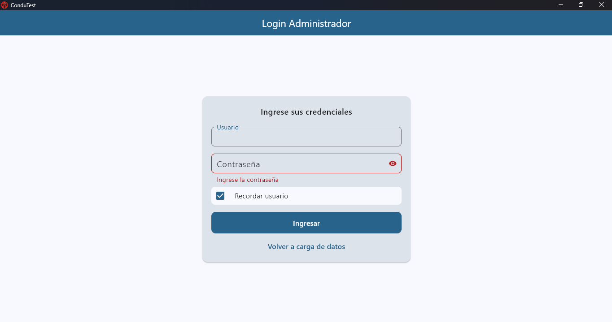
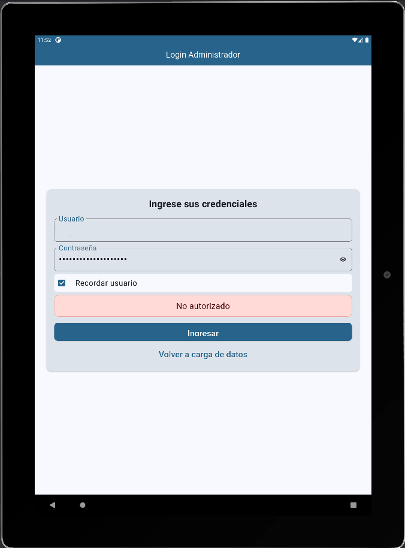

### Selección y desarrollo del examen
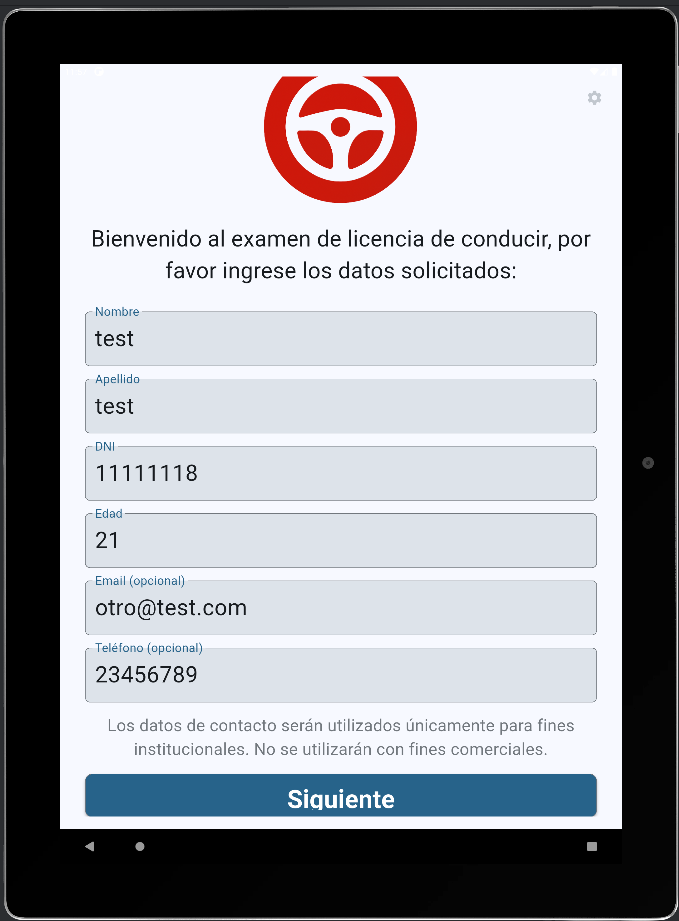
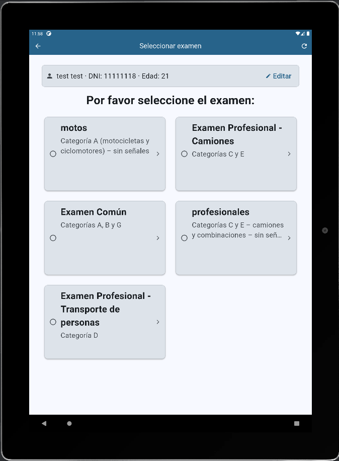
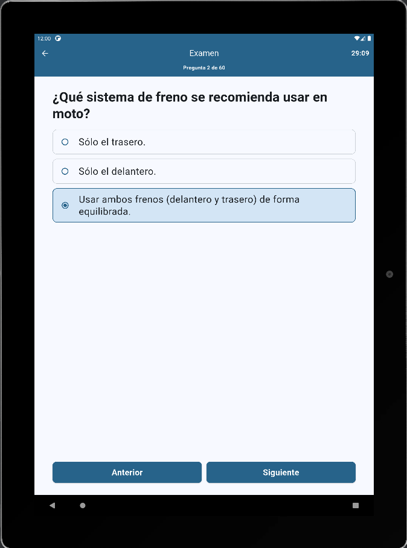
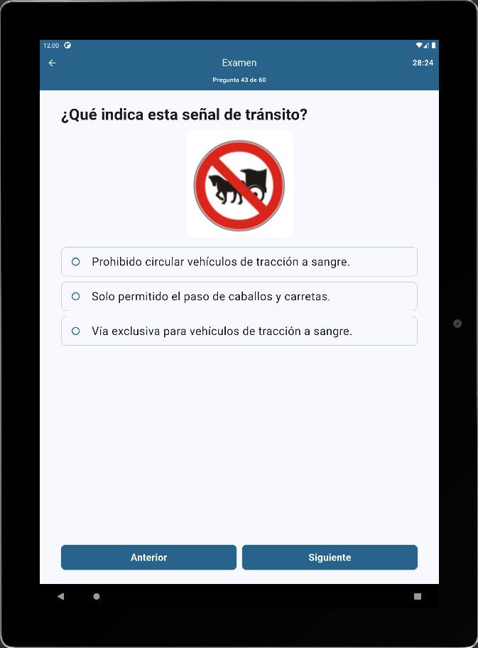

### Resultados y generación de PDF
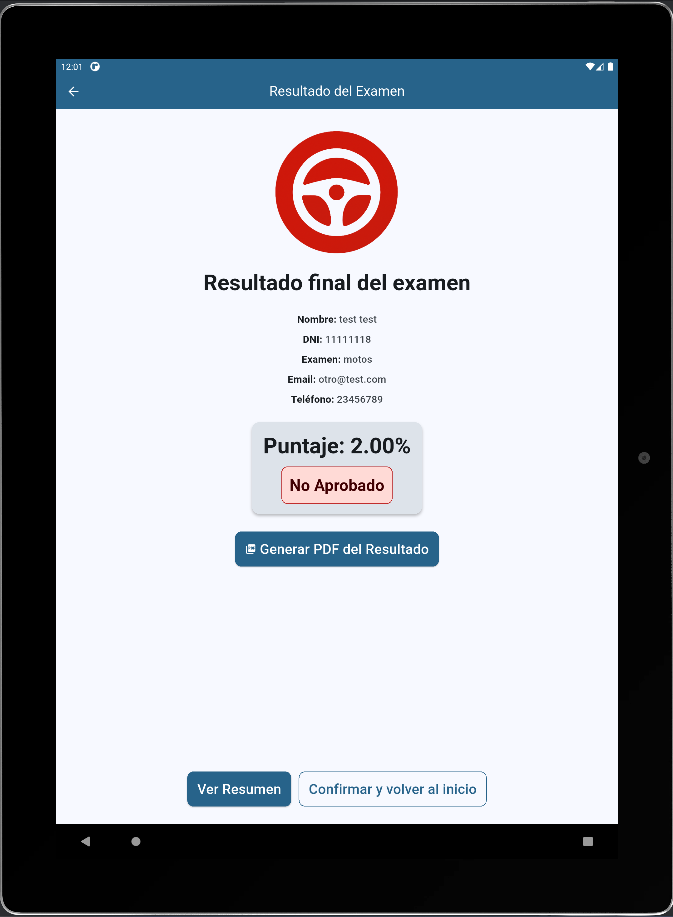
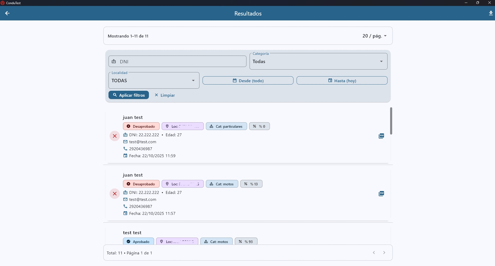
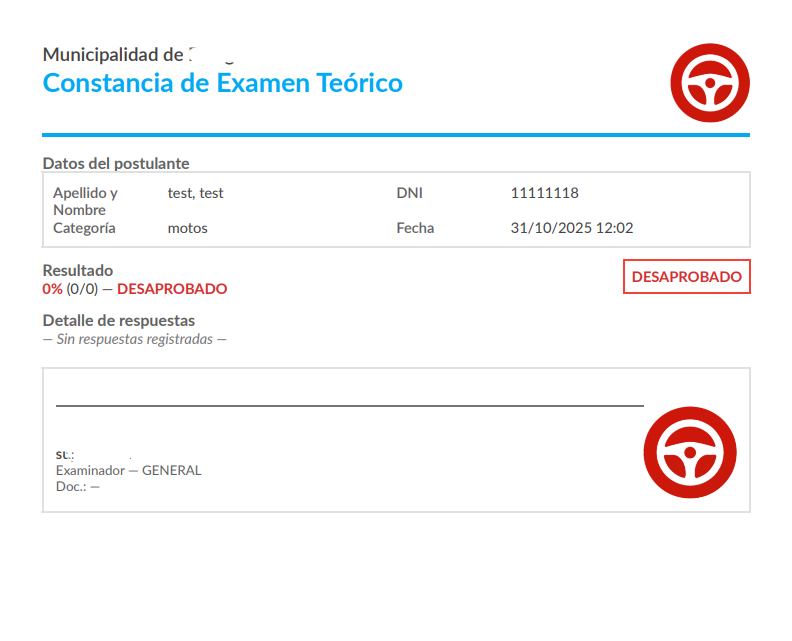

### Panel de administración
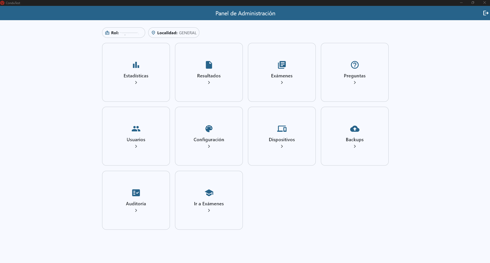
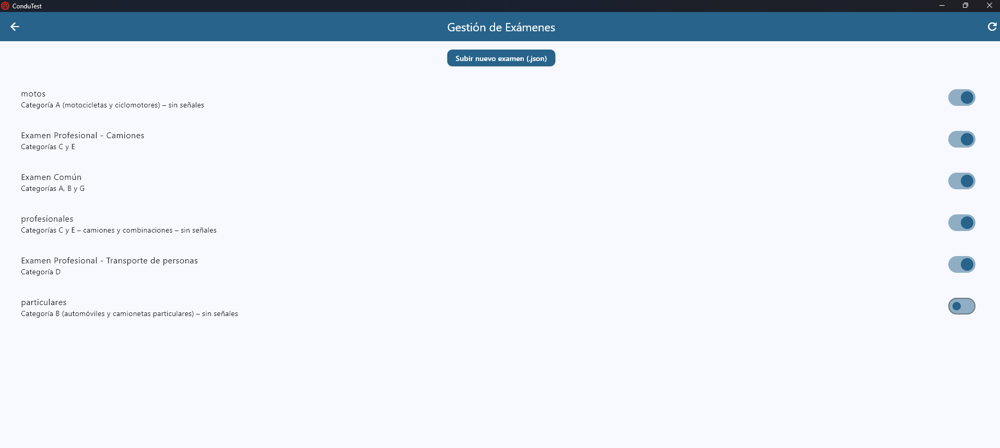
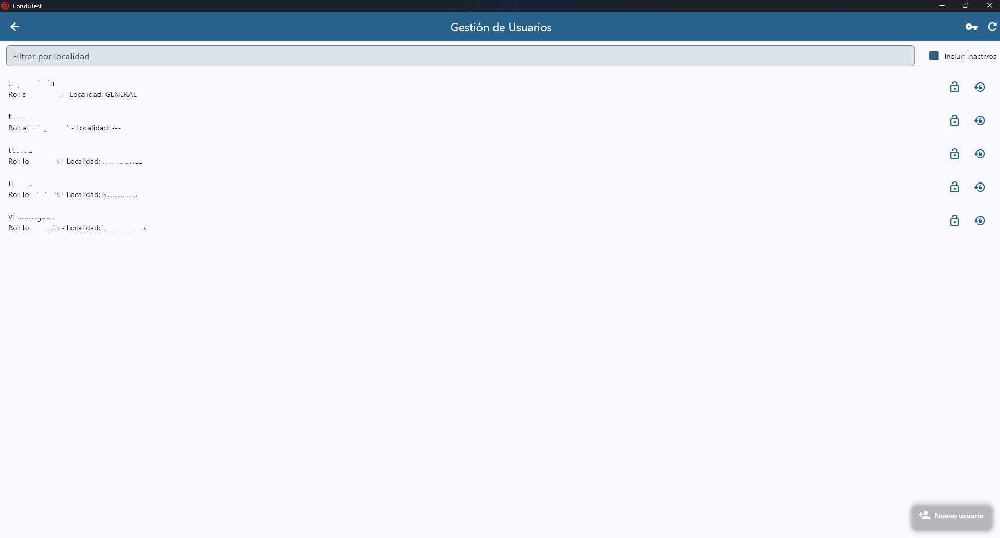
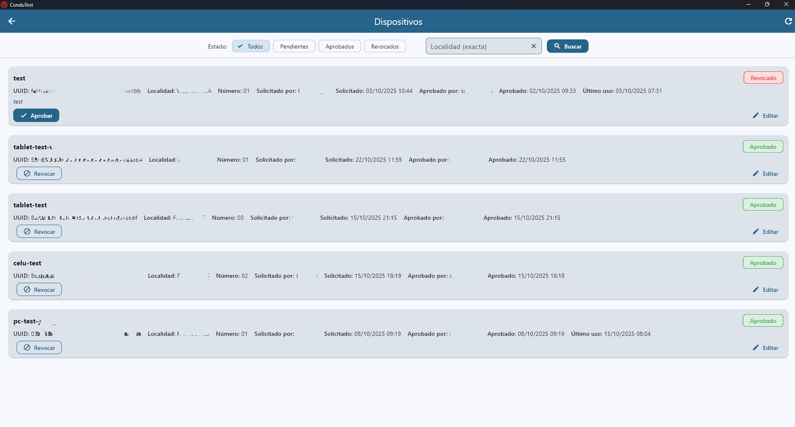
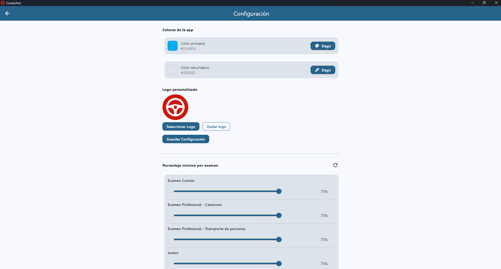
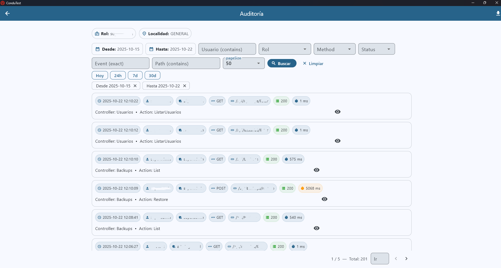
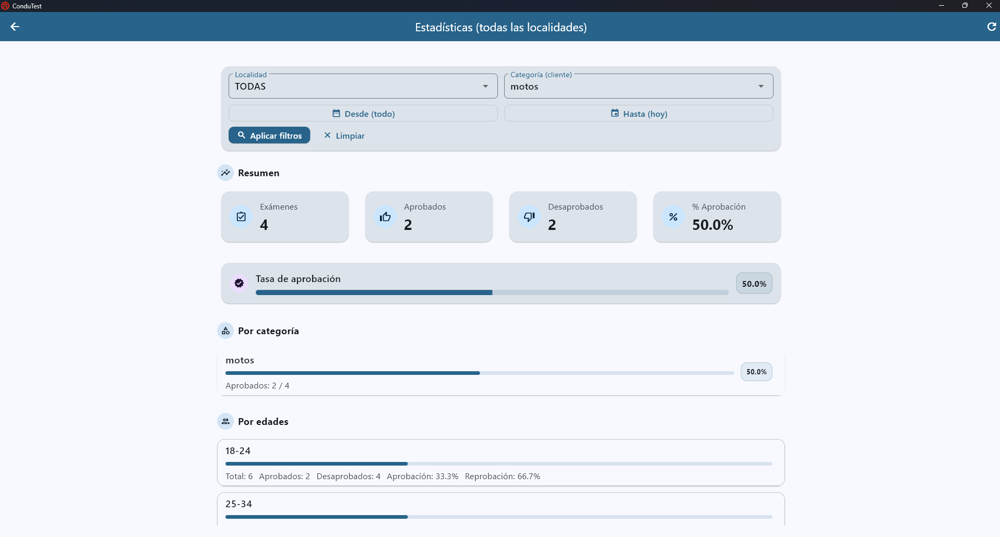

*(Las imágenes corresponden a distintas vistas dentro de la aplicación, tanto en tablets como en equipos de escritorio.)*

---

## Resultado Final

ConduTest se consolidó como una plataforma estable, escalable y lista para ser implementada en distintos municipios.  
Permite controlar de manera centralizada la gestión de exámenes, mejorar la trazabilidad de resultados y reducir significativamente el uso de papel.

---

## Próximos pasos

- Incorporar estadísticas avanzadas y analíticas automáticas  
- Añadir módulo de turnos e inscripción online  
- Permitir personalización completa por municipio  

---

## Sobre mí

Soy **Iván Fibiger**, desarrollador de software y fundador de **ID Smart Solutions**, donde diseño e implemento soluciones tecnológicas.  
Mi enfoque está en combinar **funcionalidad, seguridad y escalabilidad** en cada proyecto.

  
  
  

---
